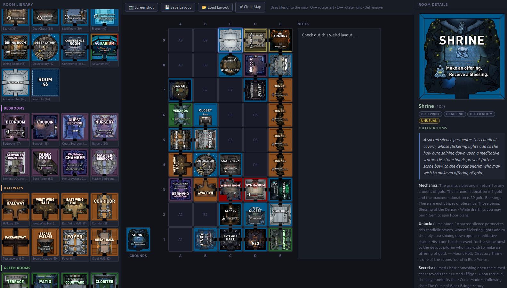
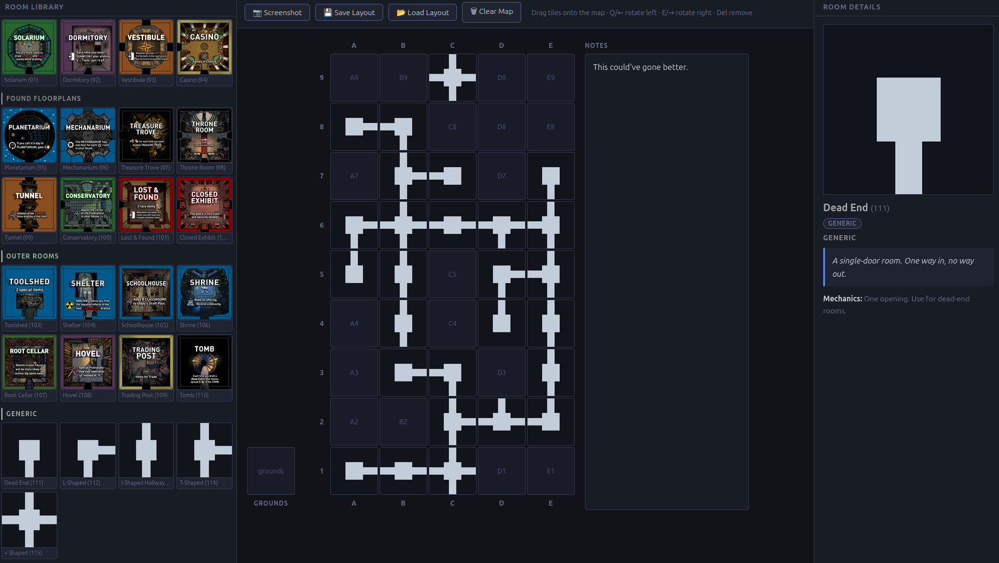

# Blue Prince Layout Builder

A browser-based drag-and-drop tool for mapping out room layouts in the puzzle game [Blue Prince](https://store.steampowered.com/app/1569580/Blue_Prince/).

> **Vibe-coded** — this entire app was vibe-coded with Claude Code in an evening.  Everything was created through natural language prompts.  Scary.


---
Explicit Room Layouts (Drag and Drop)
---

---
Generic Room Layouts
---


---

## What it does

Blue Prince is an astonishingly-deep puzzle game, where you explore a mansion that changes every day.   Some puzzles in this game have never been solved (as of this writing), and I created this as a tool to help theory-craft solutions for these puzzles.

- **Drag and drop** any of the 110 room tiles from the library onto a 9×5 grid representing the house (columns A–E, rows 1–9)
- **Rotate tiles** Select rooms with the mouse, Q/E (or arrow keys) to rotate in 90° increments
- **Room details panel** — click any tile to see its full-size image, lore text, mechanics, unlock condition, and secrets from the wiki (INCL. ALL SPOILERS)
- **Notes** — a free-text area for jotting down any text you want associated with a layout (primarily for screenshots)
- **Screenshot** — exports the current layout as a PNG
- **Save / Load** — persist layouts as JSON files and reload them later
- **5 generic path tiles** (dead end, L-shape, I-shape, T-shape, +) for sketching routes without committing to specific rooms
- Entrance Hall (C1) and Antechamber (C9) pre-placed on every fresh load, since they're always there

## Running locally

Requires Python 3 (no other dependencies):

```bash
git clone git@github.com:etotheipi/bp_layout_webapp.git
cd bp_layout_webapp
python3 -m http.server 8080
```

Then open **http://localhost:8080** in your browser.

> The app must be served over HTTP — opening `index.html` directly as a `file://` URL will fail to load the room data due to browser security restrictions.

## Controls

| Action | How |
|--------|-----|
| Place a tile | Drag from library → map cell |
| Move a tile | Drag from one cell to another |
| Remove a tile | Drag back to the library panel, or press Delete |
| Rotate selected tile | Q / ← (left) · E / → (right) |
| Select a tile | Click it |
| View room details | Click any tile (map or library) |

## Room data

Room metadata (names, lore, mechanics, unlock conditions, secrets) and tile images come from the Blue Prince community wiki. All game content belongs to its respective owners — this tool is an unofficial fan project.

## NOTES

- Some of this data was actually extracted and OCR'd from online.  There may be errors in the transcriptions.
- Only includes non-upgraded rooms.  Should probably just get the data from another source with all room upgrades and already-transcribed.
